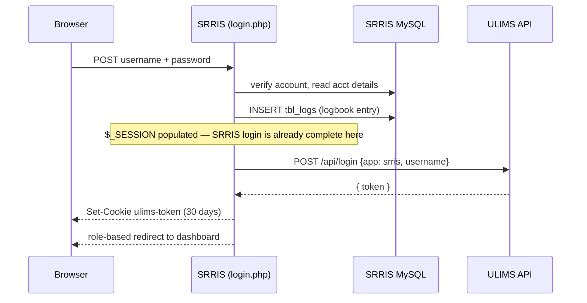
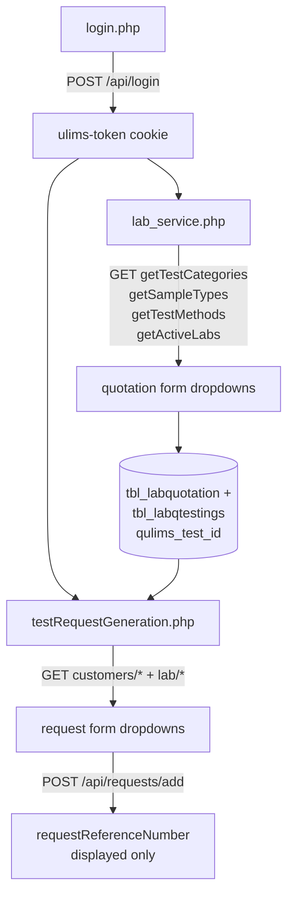

# ULIMS API — Integration Reference (as interpreted from SRRIS code)

**Status:** reverse-engineered on 2026-09-15 from the SRRIS source only. No vendor specification, OpenAPI document, or ULIMS source was available, and no live call was made against the server. Every request shape, response shape, and field type below is **inferred from how SRRIS builds the call and consumes the reply**. Where the code only touches part of a response, the rest of that response is unknown — absence from this document is not evidence that a field does not exist.

ULIMS is the external Unified Laboratory Information Management System operated by PTRI. SRRIS uses it for two things:

1. obtaining a bearer token at login (server-to-server, PHP/Guzzle), and
2. reading reference data and pushing a generated test request from the browser (jQuery AJAX).

---

## 1. Connection facts

| Item | Value | Source |
| --- | --- | --- |
| Base URL | `http://10.10.11.7:4000/api/` | [login.php:94](operations/login.php#L94) and every AJAX caller |
| Transport | Plain HTTP on a private RFC1918 address — **no TLS** | all call sites |
| Auth scheme | `Authorization: Bearer <token>` | all authenticated call sites |
| Token carrier | Cookie `ulims-token` | [login.php:105](operations/login.php#L105) |
| Server timeout | 10.0 s (login only; AJAX calls use jQuery defaults) | [login.php:95](operations/login.php#L95) |

The host, port, and path prefix are **hardcoded at every call site** — there is no configuration constant. Fourteen literals across three files must change together if ULIMS moves.

---

## 2. Login / authorization

### 2.1 The endpoint as SRRIS calls it

```
POST http://10.10.11.7:4000/api/login
Content-Type: application/x-www-form-urlencoded

app=srris&username=<SRRIS account username>
```

Built with Guzzle `form_params` in [login.php:98-103](operations/login.php#L98-L103).

**Interpretation of the contract:**

- `app` is a **fixed application identifier**, not a user input. The literal `srris` identifies the calling system to ULIMS. The API therefore appears to be multi-tenant across PTRI applications, with `app` selecting the caller.
- `username` is the SRRIS username that just authenticated locally — the same string typed into the SRRIS login form.
- **No password, secret, API key, or signature is sent.** This is the single most important inference in this document: as invoked by SRRIS, `/api/login` mints a token from an application name and a username alone. Either ULIMS trusts the caller by network position (the 10.10.11.7 subnet), or the endpoint is unauthenticated. SRRIS presents no credential ULIMS could verify.

### 2.2 Response

Only one field is read:

```json
{ "token": "<opaque string>" }
```

`json_decode($response->getBody())->token` — the body is JSON, `token` is a scalar usable directly as a bearer credential. Its format (JWT vs. opaque), its server-side lifetime, and any other response fields are **unknown**; nothing in SRRIS inspects or validates it.

### 2.3 What SRRIS does with the token

```php
setcookie('ulims-token', $token, time() + (86400 * 30), "/");
```

| Attribute | Value | Consequence |
| --- | --- | --- |
| Name | `ulims-token` | read by `getCookie('ulims-token')` in the browser |
| Max-Age | 30 days | SRRIS's own idea of validity; ULIMS's real expiry is unknown and may be shorter |
| Path | `/` | sent to every SRRIS page |
| HttpOnly | **not set** | required — page JavaScript must read it to build the `Authorization` header |
| Secure | not set | consistent with the plain-HTTP base URL |
| SameSite | not set | browser default applies |

The cookie is the *only* place the token lives. It is never stored in `$_SESSION`, never written to the database, and never re-fetched. `getCookie()` is duplicated verbatim in [lab_service.php:827-843](pages/lab_service.php#L827-L843) and [testRequestGeneration.php:406-422](pages/testRequestGeneration.php#L406-L422).

### 2.4 Position in the login sequence



The ULIMS call happens **after** the SRRIS session is established and the logbook row is written, and is wrapped in `try/catch` ([login.php:92-109](operations/login.php#L92-L109)). Two interpretive consequences:

- **ULIMS authorization is optional to SRRIS login.** If ULIMS is unreachable or errors, `catch` echoes the message and execution continues to the redirect. The user is fully logged into SRRIS with no `ulims-token` cookie. Every later ULIMS call then goes out with `Authorization: Bearer ` (empty) and fails silently — see §4.2.
- The echoed exception text is emitted **before** the `<script>` redirect, so a ULIMS outage leaks a Guzzle error string (including the internal host and port) into the page.

### 2.5 Token lifecycle gaps

- **No renewal.** Nothing re-calls `/api/login` except a fresh login. A session that outlives the ULIMS-side token has no recovery path.
- **No revocation on logout.** [logout.php](operations/logout.php) unsets the SRRIS session keys but never clears `ulims-token` and never notifies ULIMS. The bearer token survives logout in the browser for the full 30 days.
- **No 401 handling.** No caller distinguishes "token expired" from "no data".

---

## 3. Reference-data endpoints (`get*`)

Eleven read endpoints, all called from browser JavaScript. Every one follows the same shape:

```
GET  http://10.10.11.7:4000/api/<group>/<getSomething>
Authorization: Bearer <ulims-token cookie>
Accept: application/json        (jQuery dataType: 'json')
```

All are `GET`, all take no body, and all — except `getCustomerInfo` — take no parameters. Each returns a JSON object whose **single consumed key is the plural camelCase name of the collection**, holding an array of records. That naming rule (`getTestCategories` → `{ testCategories: [...] }`) holds for all ten list endpoints and is the clearest structural convention in the API.

### 3.1 Catalogue

| Endpoint | Response key | Fields SRRIS reads | Used by |
| --- | --- | --- | --- |
| `GET /api/lab/getActiveLabs` | `activeLabs` | `id`, `labName` | [lab_service.php:844](pages/lab_service.php#L844), [testRequestGeneration.php:498](pages/testRequestGeneration.php#L498) |
| `GET /api/samples/getTestCategories` | `testCategories` | `id`, `categoryName` | [lab_service.php:866](pages/lab_service.php#L866) |
| `GET /api/samples/getSampleTypes` | `sampleTypes` | `id`, `sampleType`, `testCategoryId` | [lab_service.php:894](pages/lab_service.php#L894) |
| `GET /api/samples/getTestMethods` | `testMethods` | `id`, `testName`, `method`, `fee`, `sampleType` | [lab_service.php:907](pages/lab_service.php#L907) |
| `GET /api/customers/getCustomerTypes` | `customerTypes` | `id`, `type` | [testRequestGeneration.php:424](pages/testRequestGeneration.php#L424) |
| `GET /api/customers/getBusinessNatures` | `businessNatures` | `id`, `nature` | [testRequestGeneration.php:443](pages/testRequestGeneration.php#L443) |
| `GET /api/customers/getIndustryTypes` | `industryTypes` | `id`, `industry` | [testRequestGeneration.php:463](pages/testRequestGeneration.php#L463) |
| `GET /api/customers/getMunicipalities` | `municipalities` | `id`, `name` | [testRequestGeneration.php:481](pages/testRequestGeneration.php#L481) |
| `GET /api/customers/getDiscountTypes` | `discountTypes` | `id`, `type` | [testRequestGeneration.php:518](pages/testRequestGeneration.php#L518) |
| `GET /api/customers/getPaymentTypes` | `paymentTypes` | `id`, `type` | [testRequestGeneration.php:537](pages/testRequestGeneration.php#L537) |
| `GET /api/customers/getCustomerInfo?email=<email>` | `customer` (object, not array) | `municipalitycity_id`, `typeId`, `industryId`, `natureId`, `head` | [testRequestGeneration.php:556](pages/testRequestGeneration.php#L556) |

### 3.2 Inferred record shapes

```jsonc
// activeLabs[]            — testing laboratories
{ "id": 1, "labName": "Textile Testing Laboratory" }

// testCategories[]        — top level of the sample taxonomy
{ "id": 1, "categoryName": "..." }

// sampleTypes[]           — second level; testCategoryId is the parent FK
{ "id": 1, "sampleType": "...", "testCategoryId": 1 }

// testMethods[]           — third level; `sampleType` here holds a sample-type ID
{ "id": 1, "testName": "...", "method": "...", "fee": 350.00, "sampleType": 1 }

// customer                — singular object, looked up by email
{ "municipalitycity_id": 1, "typeId": 1, "industryId": 1, "natureId": 1, "head": "..." }
```

**Two naming traps worth recording:**

- `testMethods[].sampleType` is a **foreign key, not a label.** The filter `method.sampleType == $('#sample-types').val()` ([lab_service.php:464](pages/lab_service.php#L464), [797](pages/lab_service.php#L797), [814](pages/lab_service.php#L814)) compares it against a `<select>` whose option values are `sampleType.id`. The field name reads like a string; it behaves like `sampleTypeId`. The comparison is `==`, so a numeric ID from ULIMS still matches the string DOM value.
- `getCustomerInfo` breaks both conventions: it takes a query parameter, and it returns a singular `customer` object under a singular key. Its field naming is also inconsistent with the rest of the API — snake_case `municipalitycity_id` alongside camelCase `typeId`/`natureId`, which suggests the object is a raw database row passed through rather than a mapped DTO.

### 3.3 The taxonomy the API implies

The three `samples` endpoints together describe a three-level cascade that SRRIS resolves **entirely client-side** — it downloads all sample types and all test methods once, then filters them in JavaScript rather than asking ULIMS for children of a selected parent:

```
testCategory (id, categoryName)
   └── sampleType (id, sampleType, testCategoryId)
          └── testMethod (id, testName, method, fee, sampleType → sampleType.id)
```

Interpretation: ULIMS offers no filtered/nested variants of these endpoints, or SRRIS's authors were unaware of them. The full method catalogue is shipped to every browser that opens the lab service form.

### 3.4 Where the reference data lands

The `id` values are not merely display keys — `testMethod.id` is **persisted into the SRRIS database** as `tbl_labqtestings.qulims_test_id` ([submitLabRequest.php:63-66](operations/submitLabRequest.php#L63-L66)) and read back later to build the request payload ([testRequestGeneration.php:31](pages/testRequestGeneration.php#L31)). SRRIS therefore holds long-lived references to ULIMS primary keys. If ULIMS renumbers or retires a test method, previously saved SRRIS quotations point at the wrong test or at nothing, and nothing in SRRIS would detect it.

---

## 4. Write endpoint: `POST /api/requests/add`

The one call that changes state in ULIMS. Fired by the *Generate Reference Number* button in [testRequestGeneration.php:715-727](pages/testRequestGeneration.php#L715-L727).

### 4.1 Request

The bearer header is installed via `$.ajaxSetup` immediately before the post, then the payload goes out through `$.post`:

```js
$.post('http://10.10.11.7:4000/api/requests/add', testRequestData, ...)
```

**Encoding:** `$.post` with an object serializes to `application/x-www-form-urlencoded`, **not JSON**. jQuery's deep serialization flattens the nested structure into bracket notation:

```
customer[name]=...&customer[head]=...
&requestQuotation[total]=...
&requestRequirements[labId]=...
&requestRequirements[testMethods][0][testMethodId]=12
&requestRequirements[testMethods][0][quantity]=1
```

So the receiving side must parse extended/`qs`-style bracket bodies (Express `extended: true` or equivalent). A server accepting only JSON or only flat form bodies would not see this structure. Every value arrives as a **string** — `total`, the IDs, and `quantity` are all DOM values.

**Logical payload** ([testRequestGeneration.php:679-712](pages/testRequestGeneration.php#L679-L712)):

```jsonc
{
  "customer": {
    "name": "<company> / <contact name>",   // concatenated with " / "
    "head": "...",                          // required by the form
    "address": "...",
    "email": "...",                         // also the getCustomerInfo lookup key
    "tel": "...",
    "municipalityCityId": "1",              // from getMunicipalities
    "customerTypeId": "1",                  // from getCustomerTypes
    "businessNatureId": "1",                // from getBusinessNatures
    "industryId": "1"                       // from getIndustryTypes
  },
  "requestQuotation": {
    "total": "1200.00",                     // SRRIS-computed quotation total
    "conforme": "...",
    "receivedBy": "...",
    "paymentTypeId": "1",                   // from getPaymentTypes
    "discountTypeId": "0"                   // from getDiscountTypes; "0" = none
  },
  "requestRequirements": {
    "labId": "1",                           // from getActiveLabs
    "reportDue": "YYYY-MM-DD",              // SRRIS quotation due date
    "sampleDescription": "...",
    "sampleType": "<free-text sample type NAME>",
    "testMethods": [ { "testMethodId": "12", "quantity": "1" } ],
    "additionalServices": "a, b, c"         // comma-joined checkbox labels
  }
}
```

Note the asymmetry inside `requestRequirements`: `labId` and `testMethods[].testMethodId` are ULIMS IDs, but `sampleType` is the **free-text name** stored in the SRRIS quotation (`tbl_labquotation.labq_Samples`), not a `sampleTypes[].id`. Either ULIMS resolves that string itself or it stores it verbatim; SRRIS never sends the numeric sample-type ID it had available at quotation time.

Note also that the `customer` block is sent unconditionally, whether or not `getCustomerInfo` found an existing record. The endpoint is therefore interpreted as an **upsert by email** — the UI text ("in case we can't find the saved information of this customer in ULIMS database", [testRequestGeneration.php:180-181](pages/testRequestGeneration.php#L180-L181)) supports this reading.

### 4.2 Response

```json
{ "requestReferenceNumber": "<string>" }
```

Rendered into `#generated-reference-num` and highlighted with a blink animation. This reference number is **displayed only** — it is never written back to `tbl_labquotation` or any other SRRIS table. After the page is closed the ULIMS↔SRRIS link exists only in ULIMS.

### 4.3 Failure handling

There is no `error:` callback on any of the twelve calls. The consequences per failure mode:

| Failure | What the user sees |
| --- | --- |
| Missing/expired token (401) | Dropdowns silently render empty; the button appears to hang on *"Generating…"* forever |
| ULIMS down | same as above |
| `requests/add` rejects the payload | button stays disabled at *"Generating…"*, no message, form inputs remain disabled |
| Duplicate submission | Unknown — no idempotency key is sent. The button is disabled after the first click, so this is guarded in the UI only; a page reload and re-submit would presumably create a second ULIMS request for the same SRRIS quotation. |

### 4.4 Load-order caveat in the consuming page

`loadCustomerInfo()` is called in the same `$(document).ready` block as the eight loaders ([testRequestGeneration.php:736-745](pages/testRequestGeneration.php#L736-L745)). All are asynchronous, so the `$('#municipality').val(...)` assignments in its success handler can run before the corresponding `<option>` elements exist, leaving the selects at `0` even for a customer ULIMS knows. This is an SRRIS bug rather than an API property, but it shapes what the API appears to return during debugging.

---

## 5. Consolidated flow



---

## 6. Open questions for the ULIMS owners

These cannot be answered from SRRIS code and should be confirmed before the integration is relied on:

1. What actually authorizes `POST /api/login`? Is network origin the only control, and can any username be presented?
2. What is the real token lifetime, and how does a client distinguish expiry from an empty result set? Is there a refresh or revoke endpoint?
3. Is `/api/requests/add` idempotent, and is there a key SRRIS could send to make retries safe?
4. Does `requestRequirements.sampleType` expect a name or an ID? If a name, how is it matched?
5. Are the `id` values of test methods, labs, and customer taxonomies stable for the long term? SRRIS stores `testMethod.id` indefinitely.
6. Do filtered variants exist (sample types by category, test methods by sample type), so the full catalogue need not be shipped to every browser?
7. Is a TLS endpoint available, and can the token be scoped to something narrower than a JS-readable 30-day cookie?

---

## 7. Known integration weaknesses (summary)

Recorded here because they colour any reading of the API's behaviour; the security assessment in [findings.md](findings.md) (see finding **I01**) covers them in depth.

- Cleartext HTTP, bearer token in a non-HttpOnly cookie for 30 days, not cleared at logout.
- `/api/login` sends no secret; token issuance rests on network trust.
- Base URL hardcoded in 14 places across 3 files, with no configuration seam.
- No error callbacks, no timeouts (browser side), no retry, no 401 detection.
- Guzzle exception text echoed to the page, leaking the internal host and port.
- ULIMS reference number never persisted; ULIMS primary keys persisted without any validity check.
